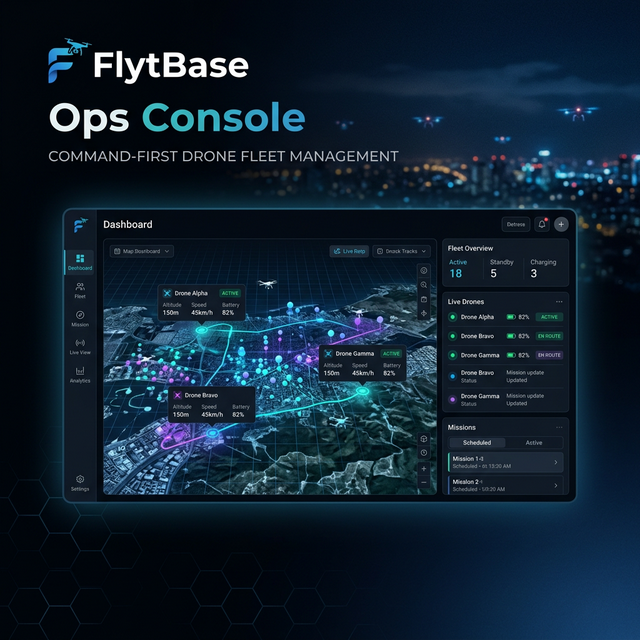

<div align="center">
  
</div>

# FlytBase Ops Console 🚁

> **FlytBase Ops Console** is a high-performance, command-centric dashboard meticulously designed for large-scale drone fleet operations. Built with a focus on **situational awareness** and **operational efficiency**, it provides a "zero-clutter" environment that empowers operators to manage complex missions with absolute clarity.

---

## 🎯 What is it?

The FlytBase Ops Console is a centralized mission control hub. It acts as the "brain" for drone operators, aggregating telemetry, live video feeds, and system alerts into a single, unified interface. Unlike traditional dashboards that overwhelm with data, this console utilizes a **Command-First design philosophy**, ensuring that every pixel serves a purpose and every action is just a keystroke away.

## 💡 How is it Useful?

In critical drone operations—whether it's security surveillance, site inspection, or emergency response—seconds matter. This console is useful because it:

*   **Reduces Cognitive Load**: The minimalist dark-mode interface minimizes distractions, allowing operators to focus on mission-critical data.
*   **Accelerates Response Time**: With an integrated **Command Bar**, operators can issue fleet-wide instructions (like "Inspect Gate 2" or "Return to Home") instantly without digging through menus.
*   **Automates Incident Workflows**: When the system detects an intrusion or anomaly, it doesn't just buzz—it generates an AI-powered summary, tracks autonomous drone dispatches, and prepares an evidence file automatically.
*   **Centralizes Multi-Site Ops**: Manage multiple geographical locations simultaneously using the **Sites Grid**, ensuring whole-fleet visibility from a single seat.
*   **Simplifies Compliance**: Every action, alert, and telemetry change is logged in a secure **Audit Trail**, making post-mission reporting and regulatory compliance seamless.

---

## ✨ Key Features

- ⌨️ **Command-First Interface**: Issue global commands through an intuitive, persistent command bar.
- � **Real-time Sync & Telemetry**: Live updates ensuring operators are always looking at the "Ground Truth."
- �️ **Intelligent Alert System**: AI-driven summaries of incidents (e.g., "1 person detected • Vehicle mismatch") to provide instant context.
- 🗺️ **High-Density Monitoring**: A scalable grid view of all active sites and assets.
- � **Evidence & Audit Repository**: A dedicated vault for historical incident logs and media recordings.
- 🎨 **Premium Professional Aesthetic**: A bespoke design system utilizing Montserrat typography and optimized contrast for 24/7 operations rooms.

## 🛠️ Tech Stack

- **React & TypeScript**: Type-safe frontend for mission-critical reliability.
- **Vite**: Ultra-fast build and development cycles.
- **Lucide Icons**: Professional-grade vector iconography.
- **Bespoke Design System**: Custom-engineered CSS tokens for a high-performance, low-latency UI.

## 🚀 Getting Started

1. **Install Dependencies**:
   ```bash
   npm install
   ```

2. **Launch Console**:
   ```bash
   npm run dev
   ```

3. **Deploy Production Build**:
   ```bash
   npm run build
   ```

---

<div align="center">
  <strong>FlytBase Ops Console</strong> — Precision in every pixel.
</div>
