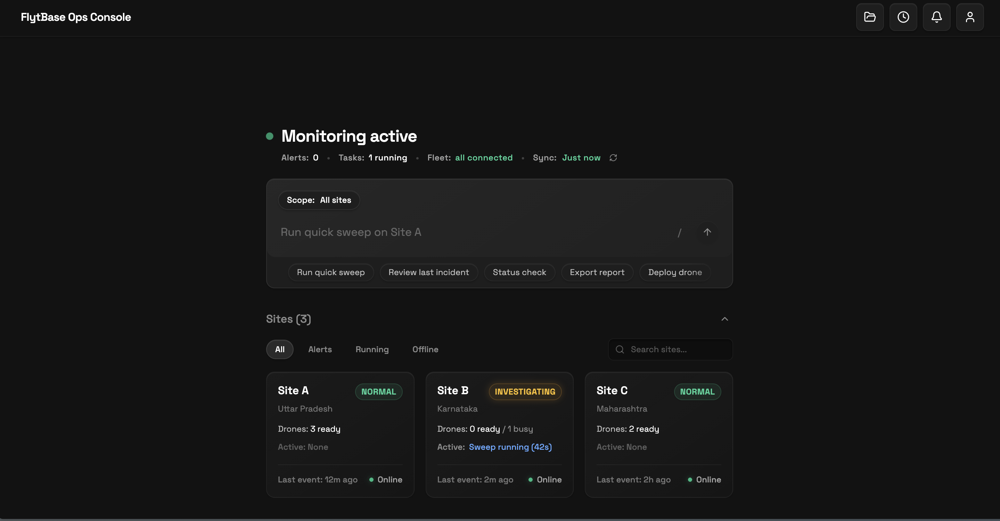
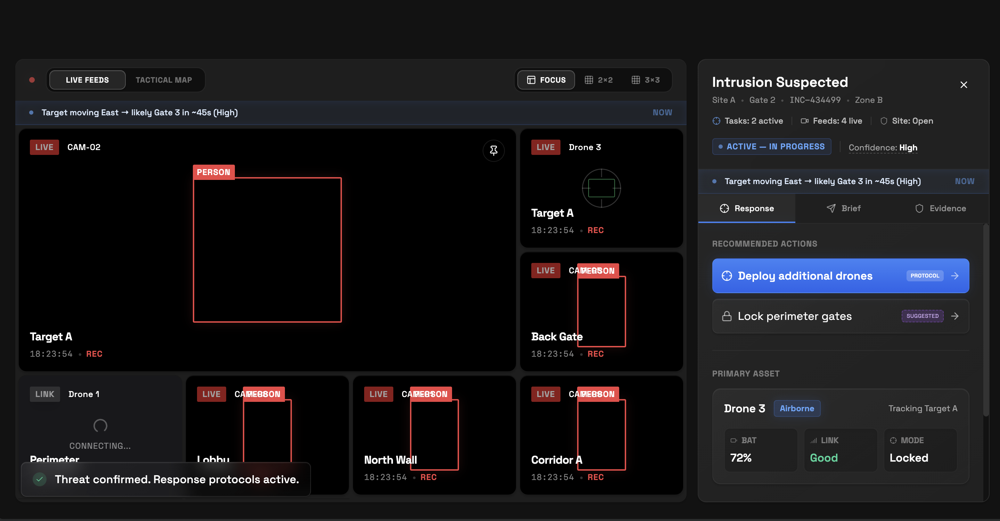
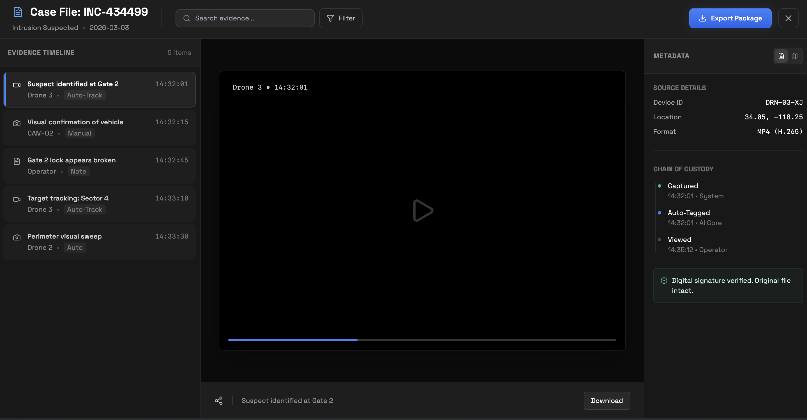
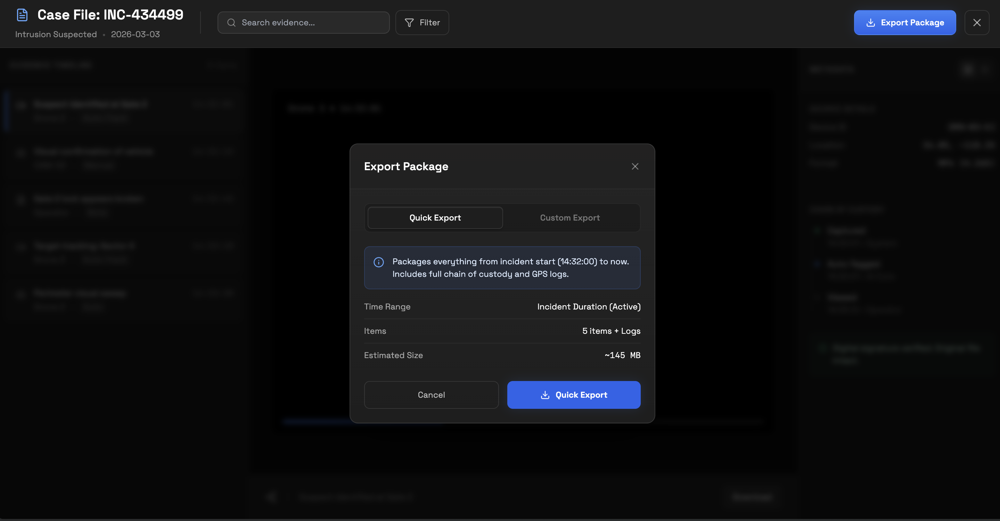

# FlytBase Ops Console

FlytBase Ops Console is a high-performance, command-centric dashboard meticulously designed for large-scale drone fleet operations. Built with a focus on situational awareness and operational efficiency, it provides a streamlined environment that empowers operators to manage complex missions with absolute clarity.

---

## What is it?

The FlytBase Ops Console serves as a centralized mission control hub. It aggregates telemetry, live video feeds, and system alerts into a single, unified interface. Moving away from traditional, data-heavy dashboards, this console utilizes a Command-First design philosophy to ensure that critical actions are readily accessible and data is presented without unnecessary clutter.


*Figure 1: Main command interface and telemetry overview, providing a zero-clutter environment.*

## Operational Benefits

In critical drone operations, efficiency and speed are paramount. The console provides several key operational advantages:

*   **Optimized Cognitive Load**: The minimalist dark-mode interface reduces visual distractions, enabling operators to maintain focus on mission-critical data.
*   **Accelerated Response Time**: An integrated Command Bar allows operators to issue fleet-wide instructions instantly, bypassing multi-step menus.
*   **Automated Incident Workflows**: Upon detecting anomalies, the system automatically generates an AI-powered summary, tracks autonomous drone dispatches, and prepares corresponding evidence records.
*   **Multi-Site Centralization**: Operators can monitor multiple geographical locations simultaneously through the Sites Grid, ensuring comprehensive fleet visibility from a single interface.
*   **Regulatory Compliance**: All actions, alerts, and telemetry changes are systematically logged in a secure Audit Trail, streamlining post-mission reporting and compliance procedures.


*Figure 2: Intelligent alert system displaying active incidents and AI summaries.*

---

## Key Features

- **Command-First Interface**: Execute global commands effectively through an intuitive, persistent command bar.
- **Real-time Synchronization**: Receive live telemetry updates to ensure operators maintain an accurate baseline of the operational environment.


*Figure 3: Scalable Sites Grid designed for monitoring all active sites and assets efficiently.*

- **Intelligent Alert System**: Utilize AI-driven summaries for incidents to gain immediate context and actionable intelligence.
- **Evidence and Audit Repository**: Maintain a dedicated secure vault for historical incident logs, audit trails, and media recordings.


*Figure 4: Secure repository for historical logs and media recording playback.*

- **High-Density Monitoring**: Access a scalable grid view designed for monitoring all active sites and assets efficiently.
- **Professional Aesthetic**: Leverage a custom design system characterized by optimized contrast, built for 24/7 operations centers.

## Technical Architecture

- **Frontend Framework**: React and TypeScript for a robust, type-safe architecture.
- **Build System**: Vite for accelerated development and compilation cycles.
- **Iconography**: Lucide Icons for clean and functional vector graphics.
- **Styling**: A custom-engineered CSS design system optimized for high-performance and low-latency rendering.

## Getting Started

1. **Install Dependencies**:
   ```bash
   npm install
   ```

2. **Launch Development Server**:
   ```bash
   npm run dev
   ```

3. **Deploy Production Build**:
   ```bash
   npm run build
   ```

---

<div align="center">
  <strong>FlytBase Ops Console</strong>
</div>
